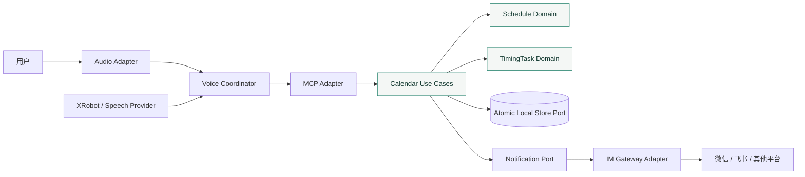

<div align="center">


<h1>VoiceLife 声活</h1>

<p><strong>语音优先、IM 辅助的本地日程与提醒系统</strong></p>

<p>
把安排说出来。本地可靠记住，到点通过语音和消息把你叫回来。
</p>

<p>
<a href="#快速开始">快速开始</a> ·
<a href="#架构">架构</a> ·
<a href="#适配器">适配器</a> ·
<a href="#开发工具">开发工具</a> ·
<a href="./CONTRIBUTING.md">参与开发</a>
</p>

<p>


</p>

</div>

> [!IMPORTANT]
> 当前仓库交付的是可编译、可串联、可验证的架构主干。日程创建链路已经通过内存适配器跑通；真实音频、XRobot、持久化和 IM 平台适配器仍待后续 Issue 填实，不能当作可用产品固件。

## 快速开始

需要 CMake，以及构建设备固件时所需的 ESP-IDF 6.0.2。Ninja 可选；未安装时主机测试会使用 CMake 默认生成器。

```bash
# 提交前完整门禁，不需要 ESP-IDF
./scripts/run_pre_submit_checks.sh

# TDD 内循环：只运行当前模块测试
./scripts/run_host_tests.sh -R schedule_policy_test

# 查看并校验可用适配器 Profile
python3 scripts/firmware.py list
python3 scripts/firmware.py validate
```

构建 ESP32-S3 架构固件：

```bash
source /path/to/esp-idf-v6.0.2/export.sh
python3 scripts/firmware.py build esp32s3-dev
```

需要合并烧录镜像时：

```bash
python3 scripts/firmware.py package esp32s3-dev
```

## 架构

VoiceLife 是一个 ESP-IDF 组件化模块单体。业务核心使用纯 C++，外部世界只能通过 Port 进入；XRobot、微信、飞书、Koishi、网络库、存储格式和具体板卡都留在 Adapter 一侧。



依赖只有一个方向：适配器依赖用例，用例依赖领域，领域不反向认识 ESP-IDF、HTTP 或平台 SDK。`scripts/check_architecture.sh` 会在 CI 中检查这条规则。

### 五个刻意做出的设计

| 设计 | 解决的问题 |
| --- | --- |
| **日程与定时任务分开建模** | Schedule 回答“安排了什么”，TimingTask 回答“何时触发哪一次”；周期、推迟不会污染日程主记录 |
| **一次 Port 完成原子写入** | 创建日程时，Schedule 与 TimingTask 要么一起成功，要么都不出现；底层可以从内存平滑迁移到 SQLite 或其他本地库 |
| **IM 只接收语义意图** | 核心发送 `schedule.created`、`reminder.due`，不出现“微信模板 ID”或“飞书卡片 JSON” |
| **能力声明代替平台分支** | 适配器声明 `rich-card`、`interactive-action`、`delivery-receipt` 等能力，配置选择实现，核心不写 `if platform == wechat` |
| **小智放在防腐层外侧** | 逐步迁移小智的音频、唤醒和 WebSocket 能力，不把它的全局状态机和板型矩阵带进业务核心 |

## 组件

| Component | 职责 | 允许依赖 |
| --- | --- | --- |
| `voicelife_contracts` | 错误、结果和工具调用公共契约 | 无 |
| `voicelife_schedule` | 日程实体、命令、结果和服务接口骨架 | contracts |
| `voicelife_timing` | 定时任务、实例和提醒规则 | contracts |
| `voicelife_mcp` | Tool Schema、注册中心与调用路由 | contracts |
| `voicelife_voice` | 会话、音频和工具调用编排 | contracts |
| `voicelife_runtime` | 唯一组装入口，不承载业务规则 | contracts、mcp、voice |

### 文件树

```text
VoiceLife/
├── .github/
│   ├── ISSUE_TEMPLATE/          # Bug、功能、设计和工程任务入口
│   ├── workflows/ci.yml         # 提交、主机测试、架构和 ESP-IDF 构建检查
│   └── pull_request_template.md # PR 结论、验证、风险和 Review 清单
├── components/
│   ├── voicelife_contracts/     # 最小公共契约，不放业务工具箱
│   ├── voicelife_schedule/      # 日程领域结构与服务接口骨架
│   ├── voicelife_timing/        # 定时任务与触发规则
│   ├── voicelife_mcp/           # MCP 工具注册中心
│   ├── voicelife_voice/         # 语音会话协调器与 Port
│   └── voicelife_runtime/       # Composition Root
├── config/
│   ├── adapter-profile.schema.json
│   └── profiles/                # 板卡与 Adapter 选择，不保存凭据
├── docs/
│   ├── adr/                     # 一次只记录一个重大架构决定
│   ├── architecture/            # 架构规范与小智迁移方案
│   ├── engineering/             # 协作、Review 和提交规范
│   └── assets/                  # README 素材
├── main/                        # ESP-IDF app_main，仅启动 Runtime
├── scripts/                     # 构建、打包、音频诊断和边界检查
├── tests/
│   ├── host/                    # 按组件拆分的纯 C++ 单元与串联测试
│   └── python/                  # 构建工具与错误输入测试
├── third_party/licenses/        # 迁移代码与工具的第三方许可原文
├── CMakeLists.txt               # ESP-IDF 工程入口
└── sdkconfig.defaults           # 受版本控制的公共默认配置
```

## 适配器

Profile 把“这次固件使用哪些实现”写成可审查配置：

```json
{
  "id": "esp32s3-dev",
  "target": "esp32s3",
  "adapters": {
    "audio": { "driver": "scaffold", "capabilities": [] },
    "speech": { "driver": "scaffold", "capabilities": [] },
    "storage": { "driver": "memory", "capabilities": ["atomic-calendar-write"] },
    "im": { "driver": "disabled", "capabilities": [] }
  }
}
```

当前已经实现 Profile Schema 校验、`sdkconfig` 选择和按 Profile 构建；Runtime 仍使用 `scaffold`、内存存储和禁用 IM 的固定装配。编译期工厂注册、能力核对和凭据引用解析尚未实现，真实 Adapter 接入前必须补齐，不能把 Profile 文件存在等同于运行时已经支持热切换。

例如接入飞书时，日程和提醒代码不需要修改。新增适配器实现、声明能力、补契约测试，再在部署配置中把 `driver` 从 `koishi-wechat` 换成 `koishi-feishu`。凭据只使用 `secret://`、`nvs://` 或 `env://` 引用，不进入 Profile 和 Git。

完整规则见 [架构与适配器设计规范](./docs/architecture/design-guidelines.md)。

## 开发工具

从 [`78/xiaozhi-esp32`](https://github.com/78/xiaozhi-esp32) 迁移并收敛了两项工具能力：

- `scripts/firmware.py`：Profile 校验、ESP-IDF 构建、合并镜像和可追溯打包。
- `scripts/audio_debug_server.py`：抓取设备通过 UDP 发出的原始 PCM，保存为 WAV，供音频链路诊断。

上游来源和改造范围记录在 [THIRD_PARTY.md](./THIRD_PARTY.md)，后续源码迁移策略见 [小智能力迁移方案](./docs/architecture/xiaozhi-migration.md)。

## 当前进度

| 能力 | 状态 | 说明 |
| --- | --- | --- |
| 组件边界与依赖检查 | 已完成 | 主机与 CI 可验证 |
| 分组件 TDD 主机测试 | 已完成 | 6 个单元测试与 1 个串联测试，可按名称筛选 |
| MCP → 日程 → 定时任务串联 | 已完成 | 使用内存适配器，仅证明架构 |
| ESP32-S3 固件构建 | 已完成 | ESP-IDF 6.0.2 已验证 |
| Profile 驱动 Runtime 装配 | 待开发 | 当前只完成 Schema、构建选择和设计契约 |
| 小智音频与 XRobot Adapter | 待开发 | 从上游能力逐段迁移 |
| 持久化 Adapter | 待开发 | 必须满足原子写入和重启恢复 |
| 微信 / 飞书 IM Adapter | 待开发 | 先稳定平台无关语义契约 |
| 真机闭环与用户试用 | 待开发 | 属于 MS3 功能 Issue |

## 文档

- [架构与适配器设计规范](./docs/architecture/design-guidelines.md)
- [ADR 0001：采用组件化模块单体与 Ports/Adapters](./docs/adr/0001-component-modular-hexagonal.md)
- [ADR 0002：采用能力驱动的适配器 Profile](./docs/adr/0002-capability-driven-adapters.md)
- [小智能力迁移方案](./docs/architecture/xiaozhi-migration.md)
- [提交描述规范](./docs/engineering/commit-convention.md)
- [协同开发规范](./docs/engineering/collaboration.md)
- [参与开发](./CONTRIBUTING.md)

## 致谢

VoiceLife 的设备侧语音能力建立在小智项目的工程经验之上。感谢 [`78/xiaozhi-esp32`](https://github.com/78/xiaozhi-esp32) 及其贡献者开放音频、唤醒、协议和构建工具实现。
